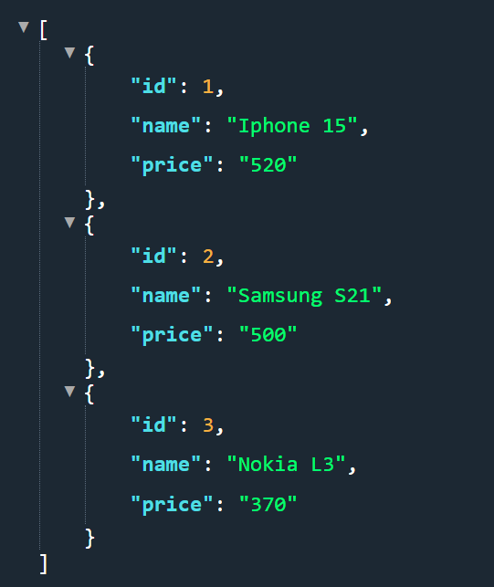
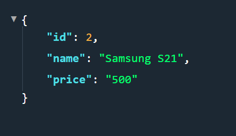

# Nodejs Express Restful Api

A comprehensive and beginner-friendly guide to creating RESTful APIs with the popular Node.js framework, Express.js. This project provides a step-by-step tutorial, code samples, and best practices for designing and implementing robust APIs. Whether you're a novice or an experienced developer, get started quickly and efficiently with ExpressRESTAPIs and streamline your API development workflow.


1. Start project with 'npm init' and enter basic details about project.

2. Create 'index.js' file in folder.

3. Install express modules in folder with command 'npm i express'. you can also install nodemon 'npm i nodemon' for live changes to to run server. 

### Create First Route

In we create simple route for get all products using GET request. 

```
const express = require('express');
const app = express();

const products = [
    { id: 1, name: 'Iphone 15', price : '520' },  
    { id: 2, name: 'Samsung S21', price : '500' },  
    { id: 3, name: 'Nokia L3', price : '370' },  
];

app.get('/api/products', (req, res) => {
    res.send(products);
})

const port = process.env.PORT || 3000;

app.listen(port, () => console.log(`Listiening on port ${port}....`))

```

Output after calling '/api/products'



### Handle Route Params

With params we can use addional paramter to request for filter and other uses.

```
app.get('/api/product/:id', (req, res) => {
    const product = products.find(product => product.id === parseInt(req.params.id));
    if (!product) return res.status(404).send('The Product with the given ID was not found.');
    res.send(product);
});

```

Output after calling '/api/product/2'

